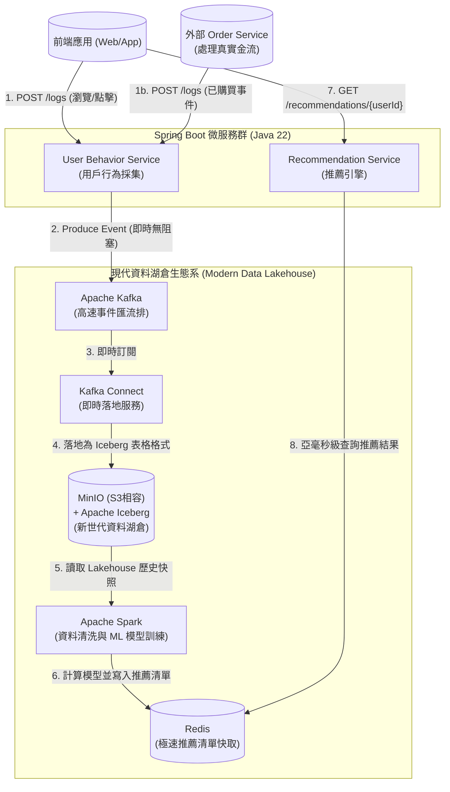

# Omni-Recommender Platform - 待辦事項與未來優化 (Backlog)

本文件作為 Omni-Recommender 平台的未來擴充、架構升級以及技術債解決方案的集中管理庫。

---

## 📌 [Epic] 透過 Apache Kafka 升級為事件驅動架構 (EDA)

**狀態**: 📋 待辦 (Backlog)  
**優先級**: 🔥 高 (下一階段架構演進)  
**領域**: 資料寫入與串流 (Data Ingestion & Streaming)

### 📖 背景與問題痛點
目前，`behavior-service` 依賴「微批次檔案同步」的方式來處理使用者行為日誌。它會先將日誌寫入本地端硬碟，然後透過排程任務（結合 Logback 的打包機制與 Java Scheduler）每分鐘將 `.gz` 壓縮檔上傳至 HDFS。
雖然這對初期原型 (MVP) 來說堪用，但這種做法將 API 伺服器與 HDFS 緊密耦合、在高併發時會產生嚴重的硬碟 I/O 瓶頸，並且讓資料進入大數據生態系前，存在至少 1 分鐘以上的延遲。

### 🎯 解決方案
將資料寫入管線遷移至基於 **Apache Kafka** 的 **事件驅動架構 (Event-Driven Architecture, EDA)**。
`behavior-service` 將不再寫入本地端檔案，而是直接將行為日誌轉化為「事件 (Event)」並送入 Kafka Topic 中，讓下游系統可以獨立且即時地去訂閱與消費這些資料。

### 💡 架構價值 (為什麼我們要這樣做？)
1. **真正的即時性與徹底解耦**: API 伺服器只需對 Kafka "Fire and Forget" (射後不理)，完全將 HDFS 的可用性與硬碟 I/O 從使用者的請求關鍵路徑中移除，大幅降低延遲。
2. **削峰填谷 (Load Leveling)**: Kafka 能在流量突增（如雙 11 促銷）時作為巨大的緩衝區，保護後端的 HDFS 或資料庫不被龐大流量壓垮。
3. **一源多用 (Multi-Consumer)**: 單一的 Kafka Topic 可以完美實現 Lambda/Kappa 雙軌架構：
   - *消費者 1 (批次)*: 透過 Kafka Connect (HDFS Sink) 將資料倒進 HDFS，留給 Spark ALS 做離線模型訓練。
   - *消費者 2 (即時)*: 透過 Flink 或 Spark Streaming 即時消費事件，用於更新即時戰情儀表板（例如：當下最熱門的機票）。
   - *消費者 3 (規則引擎)*: 當偵測到某個使用者連續點擊特定目的地多次時，立刻觸發推播，發送專屬折價券。

### 🛠️ 具體實作步驟
- [ ] **基礎設施**: 在 `docker-compose.yml` 中加入 Apache Kafka 與 Zookeeper (或採用 KRaft 模式)。
- [ ] **基礎設施**: 加入 Kafka Connect 容器，並安裝 HDFS Sink Connector 外掛。
- [ ] **後端 (`behavior-service`)**: 
  - 引入 `spring-kafka` 依賴。
  - 重構 `BehaviorController`，將原本寫入檔案的動作改為發送 JSON 訊息至 Kafka Topic (例如：`user-behavior-events`)。
  - 廢棄並移除 `BehaviorHdfsShipperAdapter` 以及 Logback 的排程打包設定。
- [ ] **資料管線 (Data Pipeline)**: 設定 Kafka Connect，使其自動將 `user-behavior-events` Topic 裡的訊息，依照日期分區 (Partition) 直接落入 HDFS 中。
- [ ] *(選用)* **Spark 重構**: 修改 Spark 批次訓練任務，改為透過 Spark Structured Streaming 直接從 Kafka 消費資料，完成從批次 (Batch) 到 Lambda 架構的完美轉型。

---

## 📌 [Epic] 雲端原生升級：以 MinIO 取代 HDFS 成為新世代資料湖泊 (Data Lake)

**狀態**: 📋 待辦 (Backlog)  
**優先級**: 🌟 中 (待 Kafka 導入後接續進行)  
**領域**: 物件儲存與資料湖泊 (Object Storage & Data Lake)

### 📖 背景與問題痛點
目前系統採用 Hadoop HDFS 作為原始日誌檔案的儲存底層。雖然 HDFS 在大數據領域歷史悠久，但它的架構較為笨重（需要 NameNode、DataNode 等複雜配置）、耗費較多資源，且不符合現代微服務與雲端原生 (Cloud-Native) 的輕量化設計趨勢。對於沒有要建立數千台伺服器叢集的專案來說，維運 HDFS 是一項不小的負擔。

### 🎯 解決方案
將 HDFS 拔除，全面替換為 **MinIO**。MinIO 是一款高效能、輕量化、且完全相容 AWS S3 協定的物件儲存 (Object Storage) 系統。
未來的資料（無論是透過目前的排程器，或是未來的 Kafka Connect）將直接作為 Object 寫入 MinIO 的 Bucket 中。

### 💡 架構價值 (為什麼我們要這樣做？)
1. **雲端原生與輕量化**: MinIO 只有單一執行檔（或單一 Docker Image），啟動極快、極度輕量，省去 Hadoop 叢集龐大的記憶體與設定負擔。
2. **無縫接軌公有雲 (AWS S3 相容)**: MinIO 完全支援 S3 API。這意味著如果未來這套系統要搬上公有雲（例如 AWS），我們的程式碼「一行都不用改」，直接無縫切換到真正的 AWS S3，達成 100% 的 Vendor-agnostic (無廠商鎖定)。
3. **生態系極佳**: Spark 完美支援透過 `s3a://` 協定直接讀取 MinIO 裡面的檔案進行運算，整體資料管線的轉型將極為平順。

### 🛠️ 具體實作步驟
- [ ] **基礎設施**: 在 `docker-compose.yml` 中移除 HDFS (NameNode, DataNode) 的相關設定。
- [ ] **基礎設施**: 在 `docker-compose.yml` 中加入 MinIO 容器，並透過預先初始化的腳本建立好專屬的 Bucket (例如 `omni-data-lake`)。
- [ ] **後端 (`behavior-service`)**: 
  - 引入 AWS S3 SDK (例如 `software.amazon.awssdk:s3`)。
  - 將原本與 `org.apache.hadoop.fs.FileSystem` 互動的 HDFS 上傳邏輯，改寫為上傳至 S3 Bucket 的邏輯。
- [ ] **大數據端 (`spark-recommender`)**: 
  - 引入 `hadoop-aws` 依賴。
  - 將 Spark 的設定加上 MinIO 的 Endpoint URL 與 Access Keys。
  - 將 `RecommenderBatchJob.java` 的讀取路徑由 `hdfs://namenode:8020/data/...` 更改為 `s3a://omni-data-lake/data/...`。

---

## 📌 [Epic] 現代資料湖倉轉型：導入 Apache Iceberg 取代傳統 Hive

**狀態**: 📋 待辦 (Backlog)  
**優先級**: 🌟 中 (建議與 MinIO 升級一併或接續進行)  
**領域**: 資料湖倉架構 (Data Lakehouse)

### 📖 背景與問題痛點
目前系統使用傳統 Hive 作為資料湖的 Table Format 抽象層。傳統 Hive 採用「目錄式分區」，存在諸多限制：
1. **無 ACID 支援**：無法高效率地對歷史日誌進行行等級 (Row-level) 的修改或刪除（例如使用者請求刪除個資、或修正錯誤的點擊紀錄）。
2. **查詢效能瓶頸**：Hive 在雲端物件儲存 (如 MinIO/S3) 上執行依賴於目錄列表 (`ls`) 操作，這在海量資料下極度緩慢。
3. **分區管理殭化**：查詢時若忘記加上分區條件，極易引發全表掃描 (Full Scan) 的效能災難。

### 🎯 解決方案
全面引進 **Apache Iceberg** 作為現代化的表格格式 (Table Format)，取代傳統 Hive。結合 MinIO 與 Spark，將原本單純的資料湖 (Data Lake) 升級為具備資料庫管理能力的 **資料湖倉 (Data Lakehouse)**。

### 💡 架構價值 (為什麼我們要這樣做？)
1. **ACID 交易與異動支援**: 完美支援 `UPDATE`、`DELETE` 與 `MERGE INTO` 等 SQL 操作，讓資料清理與個資合規 (GDPR) 變得輕而易舉。
2. **時光機 (Time Travel)**: Iceberg 以 Snapshot 記錄所有異動，資料科學家可以下達 `TIMESTAMP AS OF` 的查詢，重現過去特定時間點的資料狀態，大幅提升除錯與模型回溯追蹤的能力。
3. **隱藏式分區 (Hidden Partitioning)**: Iceberg 將分區邏輯封裝在底層 Metadata 中。使用者只需依賴業務欄位進行查詢，Iceberg 自動精準定位檔案，徹底避免全表掃描。
4. **雲端物件儲存極致最佳化**: Iceberg 直接透過 Metadata 檔案記錄實體資料路徑，完全避開了 S3/MinIO 上昂貴的目錄掃描操作，查詢速度獲得質的飛躍。

### 🛠️ 具體實作步驟
- [ ] **基礎設施**: 更新 Spark 與 Hive Metastore 的依賴，加入 `iceberg-spark-runtime` 套件。
- [ ] **Catalog 設定**: 在 Spark 中配置 Iceberg Catalog（可沿用現有的 Hive Metastore，或改用更輕量的 JDBC / REST Catalog）。
- [ ] **資料遷移**: 將現有建立的 Hive External Table 轉換或重新寫入為 Iceberg 表格格式。
- [ ] **資料管線更新**: 
  - 確保從 Kafka 或 HDFS 寫入的資料流（透過 Spark Structured Streaming 或 Kafka Connect）對接至 Iceberg 表格。
  - 實作資料整理排程任務 (Compaction Job)，定期合併 Iceberg 產生的小檔案，保持最佳查詢效能。

## 📌 [Epic] 極速推薦快取：以 Redis 取代 HBase

**狀態**: 📋 待辦 (Backlog)  
**優先級**: 🌟 高 (可獨立進行，顯著降低維運成本)  
**領域**: 線上服務層 (Serving Layer)

### 📖 背景與問題痛點
目前系統使用 Apache HBase 作為推薦清單的快取庫。雖然 HBase 適合儲存海量寬表資料，但它的架構極度笨重：不僅依賴 Zookeeper 進行協調，其底層資料更依賴 HDFS。對於我們單純的「Key-Value 查詢 (透過 UserId 查詢推薦清單)」場景而言，這宛如「用牛刀殺雞」，消耗了過多不必要的伺服器記憶體與維運心力。

### 🎯 解決方案
將 HBase 完全拔除，替換為 **Redis** (In-Memory Key-Value Store)。Spark 批次運算完畢後，將使用者的推薦結果 (JSON 陣列) 以字串或 Hash 的形式直接寫入 Redis 中。

### 💡 架構價值 (為什麼我們要這樣做？)
1. **極致輕量與高效**: Redis 是純記憶體資料庫，查詢延遲將從目前的 10ms 級別，進一步壓榨到「亞毫秒 (Sub-millisecond)」級別。且不需要 Zookeeper 與 HDFS 即可獨立運作。
2. **開發與維運極度簡單**: Spring Boot 內建了極為成熟的 `spring-boot-starter-data-redis`，無論是連線池設定還是序列化都比 HBase Client 簡單無數倍。
3. **雲端託管無縫接軌**: 在公有雲上，Redis 有非常成熟的託管服務 (如 AWS ElastiCache 或 GCP Memorystore)，能輕易達成高可用性 (HA) 與自動擴容。

### 🛠️ 具體實作步驟
- [ ] **基礎設施**: 在 `docker-compose.yml` 中移除 HBase (HMaster, RegionServer) 與 ZooKeeper，並加入 `redis` 容器。
- [ ] **大數據端 (`spark-recommender`)**: 
  - 移除 HBase 相關相依套件，引入 Jedis 或 Lettuce 等 Redis Client。
  - 將 Spark 運算完的 Dataframe 轉換為 Key-Value 格式，寫入 Redis。
- [ ] **後端 (`recommendation-service`)**: 
  - 移除 `hbase-client`，引入 `spring-boot-starter-data-redis`。
  - 實作新的 `RecommendationRedisAdapter`，以 `StringRedisTemplate` 透過 UserId 快速抓取並反序列化推薦清單。

---

## 🗺️ 未來資料湖倉架構圖 (Future Architecture Diagram)

以下是當上述三大 Epic (Kafka、MinIO、Iceberg) 全數落地後，Omni-Recommender Platform 的終極現代化架構藍圖：

*(未來的其他待辦事項與優化計畫將會陸續補充於此)*
