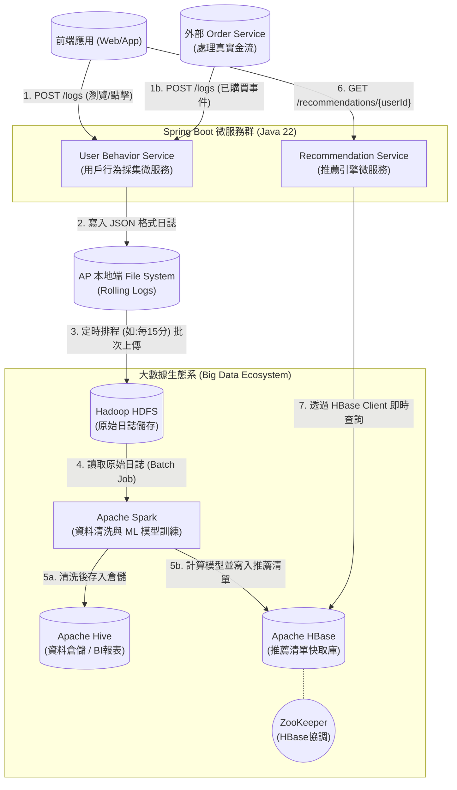

# Omni-Recommender Platform 🚀

Omni-Recommender Platform 是一個端到端 (End-to-End) 的「大數據用戶行為分析與推薦系統」。本專案結合了現代化的 Web 前端、微服務架構，以及完整的大數據生態系，展示了如何從**資料收集**、**離線機器學習運算**到**極速線上推薦**的完整資料閉環。

---

## 🌟 核心模組介紹

本專案主要由以下四個核心模組組成：

1. **`omni-frontend` (前端體驗層)**
   - 基於 **Angular 18** 打造的高質感旅遊預訂平台。
   - **Modern UI/UX**：採用毛玻璃 (Glassmorphism) 特效與暗黑模式 (Dark Mode)，帶給使用者沉浸式體驗。
   - **AI Personalization**：將「✨ Recommended For You」專屬推薦置於最顯眼處，支援優雅的動畫展開與收合。
   - **Quick View Modal**：精緻的快速預覽彈窗，不跳轉頁面即可查看行程細節，並將用戶互動 (View, Like, Add to Cart) 無縫即時傳回 HBase。
   - **Live Activity Console**：右下角內建可摺疊的實時行為監控視窗，視覺化展示日誌的即時收集過程。
   - **Rich Mock Data & Storefront**：內建包含東京、大阪、首爾、新加坡、香港，以及最新加入的 **上海、北京、北海道、沖繩** 等多國高畫質行程資料，並支援完整的條件搜尋與分頁 (Pagination) 瀏覽。

2. **`behavior-service` (行為採集微服務)**
   - 基於 **Spring Boot (Java 22)**，負責接收前端使用者的點擊、瀏覽等行為日誌。
   - 採用無阻塞的 Rolling File 策略，將日誌落地為 JSON 檔案，並透過排程任務 (Shipper) 批次上傳至 HDFS。

3. **`spark-recommender` (大數據與機器學習引擎)**
   - 基於 **Apache Spark**，擔任系統的大腦。
   - **排程機制 (Batch Scheduling)**：在正式生產環境中，此批次任務會由自動化排程工具（如 Apache Airflow 或 Linux Crontab）進行配置。系統會依照業務需求設定頻率（例如：**每 15 分鐘、每小時，或每天半夜**）自動觸發執行。
   - 每次觸發時，Spark 會從 HDFS 讀取累積的原始行為日誌進行 **Full Training (全量批次訓練)**。
   - 利用 Spark MLlib 內建的 **ALS (交替最小平方法) 協同過濾演算法**訓練推薦模型，解算使用者與商品間的隱含特徵矩陣。
   - 將訓練完成的個人化推薦結果（Top-N 清單）批次且高效地寫入 HBase 中，覆蓋舊資料以提供最新推薦。

4. **`recommendation-service` (線上推薦微服務)**
   - 基於 **Spring Boot (Java 22)**，擔任推薦資料的查詢入口。
   - 直接對接 HBase，以毫秒級的速度 (Point Get) 抓取預先算好的推薦清單，並暴露 RESTful API 供前端呼叫。如果遇到無資料的新用戶，則自動啟動 Fallback 降級機制提供熱門商品。

---

## 🔗 外部依賴與組件 (External Dependencies)

本系統高度依賴底層的大數據生態系基礎設施，所有組件皆可透過 Docker Compose 一鍵啟動：

1. **Apache Hadoop (HDFS)**
   - **功能**：作為系統的**資料湖 (Data Lake)**。
   - **描述**：提供高可用且分散式的檔案儲存能力，負責安全地存放由微服務上傳的海量、未加工的原始行為日誌 (Raw Logs)。
2. **Apache HBase**
   - **功能**：作為系統的**線上服務層 (Serving Layer)**。
   - **描述**：一個基於 HDFS 構建的 NoSQL 寬表資料庫。它能儲存巨量的推薦結果，並提供極低的延遲 (毫秒級) 讓前端 API 透過 UserID 快速抓取專屬推薦清單。
3. **Apache ZooKeeper**
   - **功能**：分散式協調服務。
   - **描述**：HBase 叢集的必要依賴，負責管理 HBase 的節點狀態、Leader 選舉與 Meta 表定位。
4. **Apache Spark**
   - **功能**：大數據 ETL 與機器學習引擎。
   - **描述**：強大的記憶體內分散式運算框架。負責處理 HDFS 上的巨量日誌，並執行耗時的 ALS 矩陣分解演算法，最後將結果直接倒出至 HBase。
5. **Apache Hive**
   - **功能**：資料倉儲與 BI 報表。
   - **描述**：提供 SQL-like 的查詢介面 (HiveQL)，讓資料分析師與營運人員能夠直接針對 HDFS 上的原始日誌進行商業智慧 (BI) 查詢與報表產出。

---

## 🗺️ 系統架構圖 (System Architecture)

以下是目前的系統資料流架構，展示了從用戶端發出請求到大數據處理的完整生命週期：



---

## 🚀 快速開始 (Getting Started)

要在一台機器上完整啟動這套端到端的大數據推薦平台，請依序執行以下步驟：

### 0. Windows 網路環境設定 (必做)
因為我們的大數據叢集是運行在 Docker 內部，為了讓你在 Windows 本機開發的 Spring Boot 與 Spark 程式能夠順利透過 Hostname 找到容器內的 HDFS 與 HBase，請務必修改 Windows 的 `hosts` 檔案。

1. 以系統管理員身分開啟記事本 (Notepad)。
2. 開啟檔案 `C:\Windows\System32\drivers\etc\hosts`。
3. 在檔案最下方加入以下設定並存檔：
```text
127.0.0.1 namenode datanode zookeeper hbase-master hbase-regionserver resourcemanager nodemanager historyserver hive-metastore-db hive-server spark-master spark-worker hbase-regionserver.omni-recommender-platform_hadoop-net
```
> [!WARNING]
> **HBase 網路名稱注意事項**：如果你將專案資料夾重新命名（例如改成 `omni-recommender`），Docker 網路名稱也會隨之改變。若啟動 `behavior-service` 時遇到 `UnknownHostException`，請查看錯誤訊息結尾的網域（例如 `hbase-regionserver.omni-recommender_hadoop-net`），並將該網域手動補上你 Windows 的 `hosts` 檔案中。

> 💡 註：在我們的 Java 程式碼 (`behavior-service` 與 `spark-recommender`) 中，已經內建了強制繞過 IP 路由與 `winutils.exe` 檢查的機制，你不需要額外安裝任何 Hadoop 環境變數，只要改好 `hosts` 就能一鍵啟動！

### 1. 啟動大數據基礎設施
請確保您的機器已安裝 Docker 與 Docker Compose。
```bash
cd docker-compose
docker-compose up -d
```
*(這將會在背景啟動 Hadoop HDFS、Apache HBase、ZooKeeper 等核心組件)*

### 2. 初始化 HBase 推薦結果表
進入 HBase Master 容器並透過 HBase Shell 建立供微服務查詢的推薦清單表：
```bash
echo "create 'recommendation', 'cf'" | docker exec -i hbase-master hbase shell -n
```
> [!WARNING]
> **資料表遺失問題 (`TableNotFoundException`)**：如果您曾經下達 `docker-compose down -v` 重製所有容器，或是將專案搬移到新路徑導致 Docker 重新建立 Volume，HBase 內部的資料將會被清空。若後端微服務拋出 `TableNotFoundException: recommendation`，請務必重新執行上述初始化指令來建立表格，並重新跑一次 Spark 訓練任務把資料倒回去！

### 3. 啟動後端微服務
請在您的 Java IDE (如 IntelliJ IDEA) 中，分別啟動以下兩個 Spring Boot 應用程式：
* `behavior-service` (預設運行於 `localhost:9001`)
* `recommendation-service` (預設運行於 `localhost:9002`)

### 4. 產生模擬資料與執行 AI 模型
首先，執行專案根目錄的 PowerShell 腳本來自動產生使用者的行為日誌，並模擬上傳至 HDFS：
```powershell
./generate_test_data.ps1
```
接著，進入 Spark 模組並執行機器學習批次任務 (ALS 協同過濾模型訓練)：
```bash
cd spark-recommender
mvn compile
mvn exec:exec
```

### 5. 啟動 Angular 前端體驗推薦威力
進入前端專案目錄，啟動網頁伺服器：
```bash
cd omni-frontend
npm install
npm start
```
啟動成功後，打開瀏覽器前往 👉 **[http://localhost:4200](http://localhost:4200)** 即可體驗專屬的 AI 機票推薦介面！

> 💡 **詳細測試與除錯指南**：如果您在啟動過程中遇到任何網路或設定問題，請參閱根目錄下的 **[`E2E_TESTING_GUIDE.md`](./E2E_TESTING_GUIDE.md)**，裡面有詳細的網路設定與排錯步驟（例如設定 Windows `hosts` 檔案）。

---

## 🔮 未來展望與架構演進 (Future Roadmap)

本平台仍具備極大的擴充彈性，詳情請參考 **[`BACKLOG.md`](./BACKLOG.md)** 中的大型重構計畫 (Epic)，包含：
- 導入 **Apache Kafka** 升級為真正的事件驅動架構 (EDA)。
- 拔除 HDFS，以 **MinIO + Apache Iceberg** 建立現代資料湖倉 (Modern Data Lakehouse)。
- 以 **Redis** 替換 HBase 達成亞毫秒級的極速快取。
