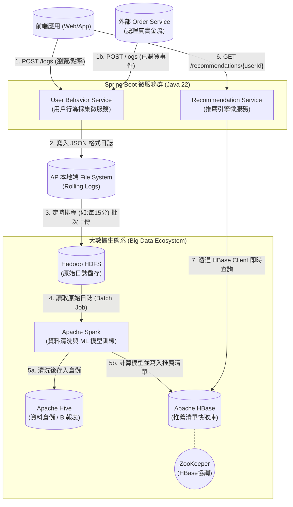

# 系統架構設計 (System Architecture Design)

這份文件詳細描述了「旅遊電商用戶行為分析與推薦系統」的服務拆分、外部依賴以及整體的資料流向。本系統定位為純粹的「數據分析與推薦中台」，真實的訂單處理與金流由外部核心系統負責，本系統僅接收前端或外部服務發送的「已購買」事件日誌作為模型訓練特徵。

---

## 1. 系統架構圖 (Architecture Diagram)

以下是透過 Mermaid 繪製的系統架構圖，展示了從用戶端發送請求，經過微服務，再進入大數據生態系進行處理，最後提供推薦查詢的完整流程：

---

## 2. 微服務規劃 (Microservices Planning)

根據 Bounded Context 設計，系統可以劃分為以下兩個核心微服務（或模組化單體架構模組）：

### 2.1 User Behavior Service (用戶行為採集微服務)
*   **定位**：負責接收極高併發的前端與外部系統行為打點請求，首要任務是「不掉資料」與「低延遲回覆」。
*   **技術要點**：
    *   **無狀態 (Stateless)**：易於橫向擴展 (Scale-out) 以應對大流量。
    *   **本地快取策略**：使用 SLF4J + Logback / Log4j2 的 RollingFileAppender，將請求直接非同步 (AsyncAppender) 寫入本地 Disk，確保 API 延遲極低 (< 10ms)。
    *   **資料搬運 (Shipper)**：內建一個 `@Scheduled` 排程任務，每隔固定時間（例如 15 分鐘），使用 `hadoop-client` 將本地已經 roll 完的日誌檔 `put` 到 HDFS 的 `/data/raw/behavior/YYYY-MM-DD` 中。

### 2.2 Recommendation Service (推薦引擎微服務)
*   **定位**：負責向前端提供即時的推薦清單。
*   **技術要點**：
    *   **依賴外部儲存**：高度依賴 HBase 作為 Read Model，透過 `hbase-client` 以 UserID 為 RowKey，進行高速的點查 (Point Get)。
    *   **降級與容錯 (Fallback)**：當 HBase 異常，或者某個新使用者 (Cold Start) 尚無推薦結果時，微服務應回傳預設的「熱門商品」或「最新商品」作為替代方案。

---

## 3. 外部依賴與組件 (External Dependencies)

本系統高度依賴部署的大數據生態系，詳細相依關係如下：

### 3.1 儲存層依賴 (Storage Dependencies)
*   **Hadoop HDFS (Port: 8020)**：用作資料湖 (Data Lake)，存放歷史以來的全量原始日誌。微服務(UBS) 需要透過 `hadoop-client` JAR 檔，依賴 HDFS 的 IPC port (8020) 進行連線寫入。
*   **Apache HBase (Port: 2181, 16000, 16020)**：做為 Key-Value Store。Recommendation Service 需透過連線至 ZooKeeper (2181) 取得 HBase 表的 Meta 資訊，再向 RegionServer 請求資料。
*   **Apache Hive (Port: 10000)**：資料倉儲，供營運人員使用 BI 工具，或是未來透過 Spring Boot JDBC 連接 HiveServer2 查詢業務報表。Hive 的元數據依賴於 PostgreSQL。

### 3.2 運算層依賴 (Compute Dependencies)
*   **Apache Spark (Spark Master Port: 7077)**：核心的 ETL 與機器學習引擎。
    *   負責讀取 HDFS 中的 `/data/raw` 資料。
    *   使用 Spark MLlib 訓練 ALS 模型。
    *   運算完成後，透過 HBase 的 `TableOutputFormat` API，分散式批次將巨量資料寫入 HBase。
*   **YARN (Port: 8088)**：若未來 Spark 叢集改為 `yarn-client` 或 `yarn-cluster` 模式提交，則依賴 YARN 來分配 CPU 與記憶體資源。

---

## 4. 資料庫 (HBase) 結構設計預覽

為了讓 Recommendation Service 達到最高查詢效率，HBase 的表結構 (Schema) 預計設計如下：

*   **Table Name**: `user_recommendations`
*   **RowKey**: `userId` (例如: `U100234`)，為了避免 HBase Region 產生熱點 (Hotspotting)，可能需要對 UserID 進行 Hash 或反轉 (Reverse)。
*   **Column Family**: `cf` (或 `recommends`)
*   **Column**: `data` (值為 JSON 格式字串，例如 `["trip_A01", "trip_B02", "trip_C03"]`)

透過這個設計，Recommendation Service 只需要執行 `Get(RowKey)` 就能一次拿回整個陣列，時間複雜度為 O(1)。
